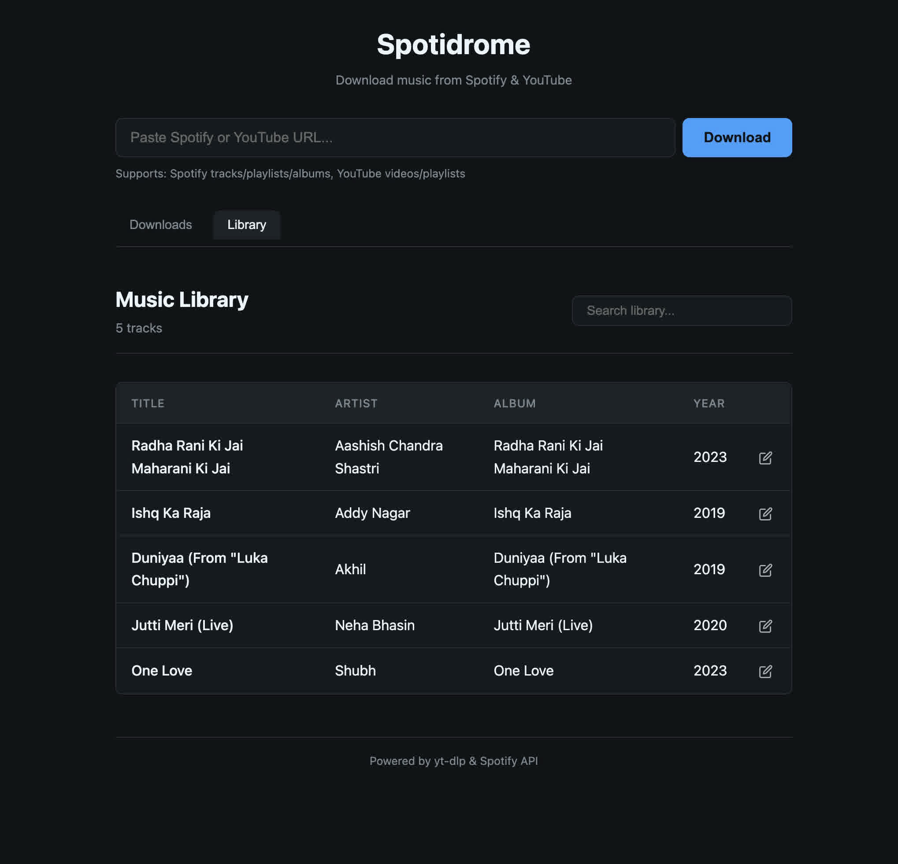

# Spotidrome

Spotidrome is a lightweight, self-hosted web application designed to download and manage music libraries. It bridges the gap between streaming services and local music collections by downloading high-quality audio and enriching it with comprehensive metadata.

When I was setting up Spotdl, I found it to be a bit complex to configure and use. So, I decided to create a simple web application to make it easier to download music and manage the library. The frontend (HTMX + Jinja2) is mostly vibe-coded using Claude Opus 4.5 and Google Antigravity. The backend is a FastAPI application that uses yt-dlp to download music and mutagen to add metadata obtained from Spotify using spotipy library.



## Features

### Music Downloader
- **Multi-Source Support**: Downloads tracks, albums, and playlists from Spotify. Also supports direct YouTube video and playlist downloads.
- **High Quality**: Retrieves the best available audio quality using yt-dlp.
- **Background Processing**: Handles downloads asynchronously, allowing the interface to remain responsive while processing large queues.

### Metadata & Lyrics
- **Automatic Tagging**: Automatically applies ID3 tags including Title, Artist, Album, Year, and Track Number.
- **Cover Art**: Embeds high-resolution album art directly into the audio files.
- **Synchronized Lyrics**:
  - Fetches time-synced lyrics from sources like Musixmatch and LRCLIB.
  - Embeds standard `USLT` (unsynchronized) and `SYLT` (synchronized) frames into MP3 files.
  - Generates sidecar `.lrc` files for maximum compatibility with players.

### Library Management
- **Browsing**: View your downloaded collection in a clean, tabular layout.
- **Instant Search**: Filter tracks by title, artist, or album with real-time search.
- **Metadata Editor**: Built-in editor to manually correct or update track details, lyrics, and cover art.

### User Interface
- **Minimalist Design**: A clean, dark-mode interface built with modern CSS.
- **Responsive**: Optimized for desktop use but accessible on mobile devices.
- **Dynamic Updates**: Uses HTMX for seamless, page-refresh-free interactions.

## Development

Spotidrome is built with Python (FastAPI) and uses `uv` for dependency management.

### Prerequisites
- Python 3.12 or higher
- `uv` (modern Python package manager)
- `ffmpeg` (required for audio conversion)

### Setup

1. Check out the code:
   ```bash
   git clone https://github.com/yashhere/spotidrome
   cd spotidrome
   ```

2. Install dependencies:
   ```bash
   uv sync
   ```

3. Install pre-commit hooks (for linting and formatting):
   ```bash
   uv run pre-commit install
   ```

### Running Locally

Start the development server with hot-reloading:

```bash
uv run uvicorn app.api:app --host 0.0.0.0 --port 8095 --reload
```

The application will be available at `http://localhost:8095`.

### Project Structure

- `app/`: Backend application logic.
  - `api.py`: FastAPI application endpoints.
  - `downloader.py`: Core logic for yt-dlp integration.
  - `lyrics.py`: Lyrics fetching and embedding.
- `templates/`: Jinja2 HTML templates.
- `static/`: CSS and client-side assets.

### Code Quality

This project uses:
- **Ruff**: For Python linting and formatting.
- **Isort**: For Python import sorting.
- **Prettier**: For HTML and CSS formatting.

Run checks manually:
```bash
uv run pre-commit run --all-files
```
